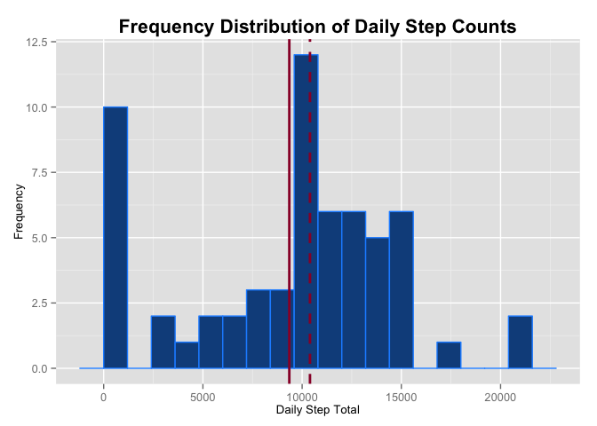
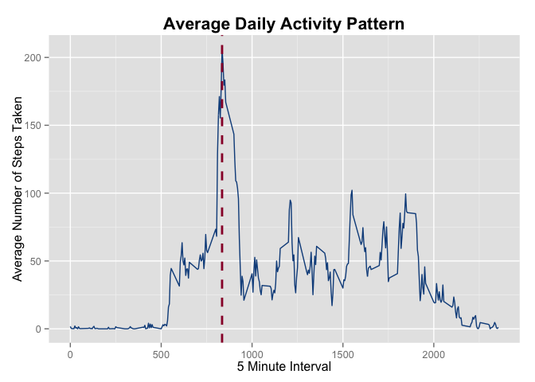
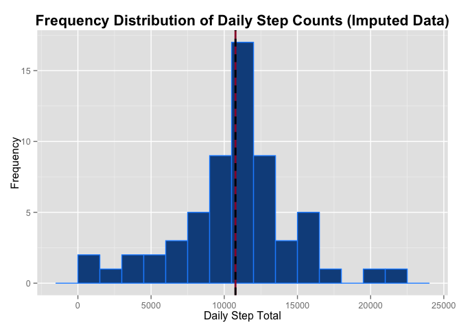
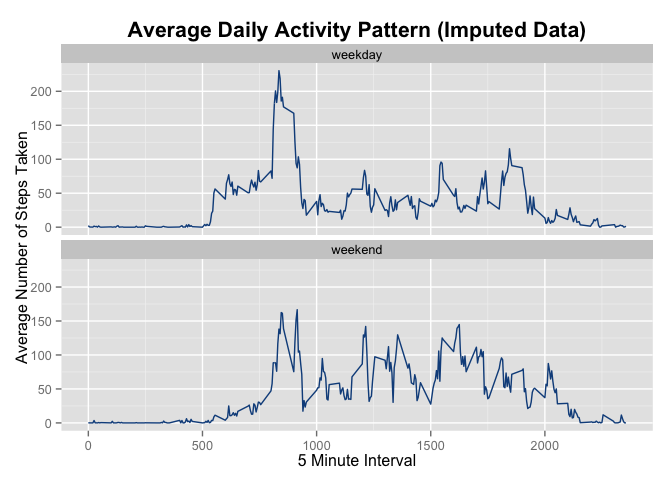

# Reproducible Research: Peer Assessment 1


## Loading and preprocessing the data

* Load the required libraries
    
    ```r
    library(reshape2)
    library(ggplot2)
    library(dplyr)
    ```
* Parse the current working directory for the data file. If it is absent, download it; otherwise, continue:
    
    ```r
    temp.f <- "./repdata-data-activity.zip"
    if (!file.exists(temp.f))
    {
    fileURL <- "https://d396qusza40orc.cloudfront.net/repdata%2Fdata%2Factivity.zip"
    download.file(fileURL, destfile = temp.f, method = "curl")
    rm(fileURL)
    }
    ```
* Use unzip to parse the contents of the archive, and create an index of the results. Using `unz` and `read.csv`, open a connection to the archive, and read the contents of the file into a new dataframe:
    
    ```r
    files <- unzip(temp.f, list = TRUE)
    activity <- read.csv(unz(temp.f, files[1, 1]), stringsAsFactors = FALSE)
    ```
* The variables included in this dataset are:
    + **steps**: Number of steps taking in a 5-minute interval (missing values are coded as `NA`).
    + **date**: The date on which the measurement was taken in YYYY-MM-DD format.
    + **interval**: Identifier for the 5-minute interval in which the measurement was taken.
* Convert the date column to `POSIXct` format, and then reduce the data to its molten form. Date and interval are the id variables, and number of steps is the measured quantity.
    
    ```r
    activity$date <- as.POSIXct(strptime(activity$date, format = "%Y-%m-%d"))
    molten <- melt(activity, id = c("date", "interval"), measure = "steps",
               variable.name = "steps")
    ```
* The data should now be in a format that is suitable for further analysis


## What is mean total number of steps taken per day?

* The molten data is cast with the aggregating function `sum` and a histogram is generated.
    
    ```r
    dailySteps  <- dcast(molten, date ~ steps, sum, na.rm = TRUE)
    h1 <- ggplot(dailySteps, aes(x = steps)) +
    geom_histogram(binwidth = 1200, color = "dodgerblue", fill = "dodgerblue4") +
    geom_vline(aes(xintercept = mean(steps)),
               linetype = "solid", color = "#990033", size = 1) +
    geom_vline(aes(xintercept = median(steps)),
               linetype = "dashed", color = "#990033", size = 1) +
    ggtitle("Frequency Distribution of Daily Step Counts") +
    ylab("Frequency") + xlab("Daily Step Total") +
    theme(plot.title = element_text(size = 16, face = "bold", vjust = 0.75),
          axis.title.y = element_text(size = 10, vjust = 0.35),
          axis.title.x = element_text(size = 10))
    print(h1)
    ```
    
     
* Note the large concentration of values in the 0 range which corresponds to the large number of `NA` values present in the dataset.
* The mean of the total number of steps taken per day is 9354.23, denoted by the solid line above.
* The median of the total number of steps taken per day is 10395, denoted by the dashed line above.


## What is the average daily activity pattern?

* Below is a time series plot of the number of steps taken versus the 5-minute intervals, averaged across all days.
    
    ```r
    activityPattern <- dcast(molten, interval ~ steps, mean, na.rm = TRUE)
    g1 <- ggplot(activityPattern, aes(x = interval, y = steps)) +
    geom_line(color = "dodgerblue4") + 
    geom_vline(aes(xintercept = activityPattern[which.max(steps), 1]),
               linetype = "dashed", color = "#990033", size = 1) +
    ggtitle("Average Daily Activity Pattern") +
    ylab("Average Number of Steps Taken") + xlab("5 Minute Interval") +
    theme(plot.title = element_text(size = 16, face = "bold", vjust = 0.75),
          axis.title.y = element_text(size = 12, vjust = 0.35),
          axis.title.x = element_text(size = 12))
    print(g1)
    ```
    
     
* The 5-minute interval containing the maximum number of steps is 835, as denoted by the vertical line in the plot above.

## Imputing missing values

* There are 17568 observations in the dataset, 2304 of which are missing values.
* A new dataset `moltenI` will be created by filling any missing values with the mean of the corresponding 5-minute interval.
    
    ```r
    moltenI <- molten %>% group_by(interval) %>%
    mutate(value = ifelse(is.na(value), mean(value, na.rm = TRUE), value))
    ```
* The imputed data is recast and a new histogram is generated.
    
    ```r
    dailyStepsI  <- dcast(moltenI, date ~ steps, sum, na.rm = TRUE)
    hI <- ggplot(dailyStepsI, aes(x = steps)) +
    geom_histogram(binwidth = 1500, color = "dodgerblue", fill = "dodgerblue4") +
    geom_vline(aes(xintercept = mean(steps)),
               linetype = "solid", color = "#990033", size = 1) +
    geom_vline(aes(xintercept = median(steps)),
               linetype = "dashed", color = "black", size = 1) +
    ggtitle("Frequency Distribution of Daily Step Counts (Imputed Data)") +
    ylab("Frequency") + xlab("Daily Step Total") +
    theme(plot.title = element_text(size = 16, face = "bold", vjust = 0.75),
          axis.title.y = element_text(size = 12, vjust = 0.35),
          axis.title.x = element_text(size = 12))
    print(hI)
    ```
    
     
* The mean of the imputed data is 10766.19, represented by the solid red line above.
* The median of the imputed data is 10766.19, represented by the dashed black line above.
* The mean and median both increase as expected given that we have replaced previously missing observations with positive values. This imputation increases the total number of steps taken; however, the total number of days remains identical.
* Note as well that the large cluster of samples that was present at or around zero has been re-distributed.


## Are there differences in activity patterns between weekdays and weekends?

* Create a new factor variable in the dataset indicating whether a given date is a weekday or weekend.
    
    ```r
    moltenIWD <- moltenI %>% 
    mutate(weekday = ifelse(weekdays(date) == "Saturday" | weekdays(date) == "Sunday", "weekend", "weekday"))
    ```
* Below is a time series panel -- using the imputed dataset -- of the number of steps taken versus the 5-minute intervals, averaged across all days.
    
    ```r
    activityPatternIWD <- dcast(moltenIWD, interval + weekday ~ steps, mean, na.rm = TRUE)
    g2 <- ggplot(activityPatternIWD, aes(x = interval, y = steps)) +
    geom_line(color = "dodgerblue4") + 
    ggtitle("Average Daily Activity Pattern (Imputed Data)") +
    ylab("Average Number of Steps Taken") + xlab("5 Minute Interval") +
    theme(plot.title = element_text(size = 16, face = "bold", vjust = 0.75),
          axis.title.y = element_text(size = 12, vjust = 0.35),
          axis.title.x = element_text(size = 12))+
    facet_wrap(~weekday, nrow = 2)
    print(g2)
    ```
    
     
* It is evident that weekday activity differs from weekend activity. Weekdays feature a flurry of movement in the early morning, but far less throughout the day. Activity does appear restricted over the day save for some spikes that likely correspond with lunch, dinner and evening activities.
* The weekend activity appears to be distributed more evenly over the day, and doesn't feature the same early morning spike of activity evident on weekdays. This likely corresponds with 'sleeping in' on the weekend, but maintaining longer periods of moderate activity over the balance of the day as the subject is likely free from the restrictions of school, work, etc.
